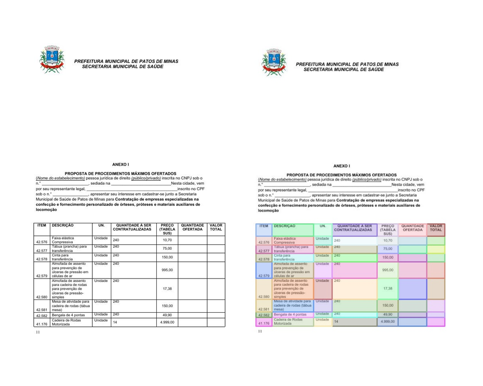
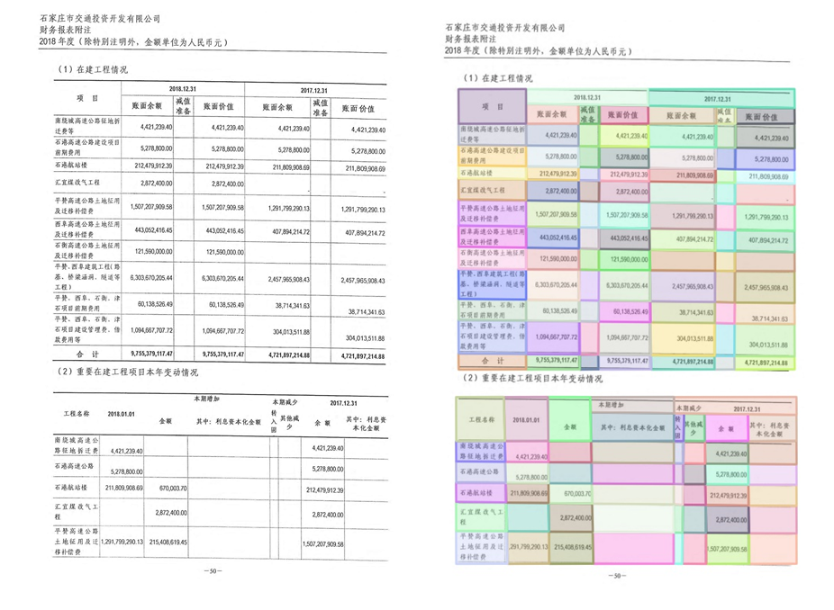
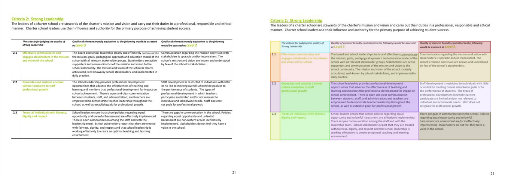
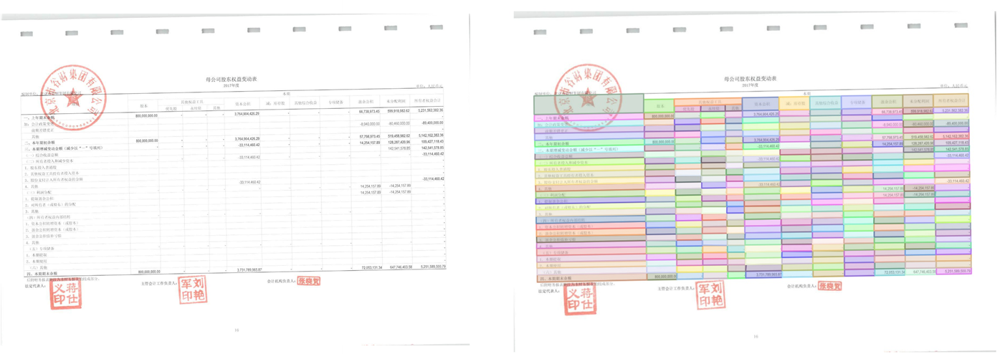
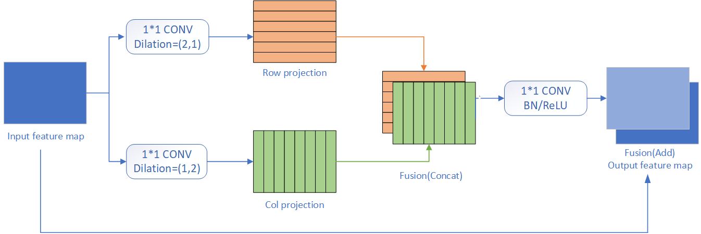
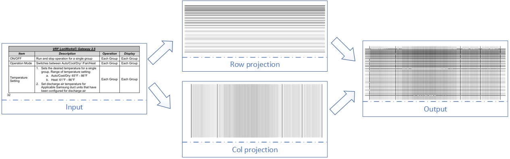
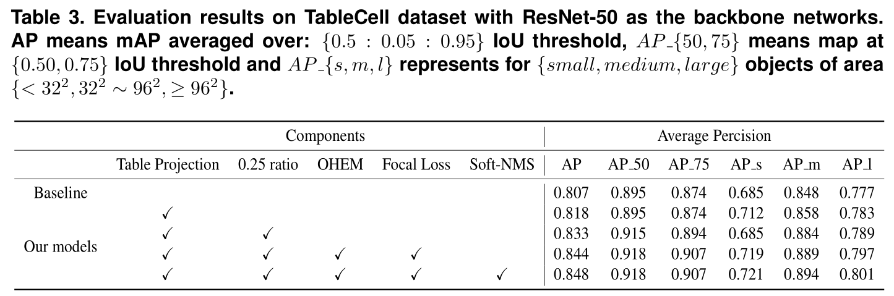
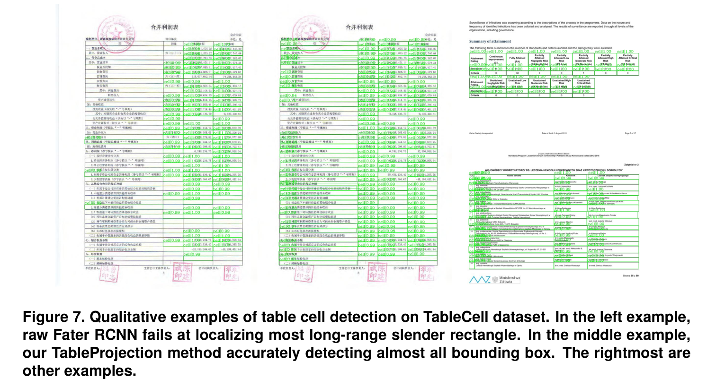

# TableCell

**Image-based table cell detection: a new dataset and an improved detection method**

## Introduction.

In this repo, we present TableCell, a new image-based dataset which contains
5262 samples with 170K high precision cell-wised annotations based on a novel
semi-supervised method.

Furthermore, we come up with an efficient table projection method to facilitate
capturing long-range global feature, which consists of row projection and column
projection.

## TableCell dataset.

***Note: a detailed construction tutorial and code will be released to ease the burden of annotating a more adequate personal dataset after refactoring.***

There are 5262 images with 170K annotations in total. TableCell dataset will be made available at
https://github.com/weidafeng/TableCell upon our paper publication. 

It contains four types tabular documents.
1. Electronic sample with complete lines
2. Scanner sample with partial lines
3. Electronic sample with partial lines
4. Scanned sample with complete lines  

### Some Annotation samples.  






## Table Projection Module.

Despite the performance of universal object detectors has been dramatically 
improved thanks to the advance of deep convolutional neural networks, 
there is a relative scarcity of deep learning approaches for table or 
even table cell detection. 
Even with strong learning ability, common object detection models don't 
suffice as the tabular data also require global information to identify 
table cell boundaries because both cells and cell separators contain 
large regions of white space.

Our proposed method named `Table Projection Module` designs architectures 
that can capture global information involving both row and column. 
Here is the architecture and simple visualization demo to understand.






## Getting started.

We use the open source framework `[MMDetection](https://github.com/open-mmlab/mmdetection)` to train models on the TableCell.
Please follow the [official INSTALL.md](https://github.com/open-mmlab/mmdetection/blob/master/README.md)for installation and dataset preparation, and see the [official GETTING_STARTED.md](https://github.com/open-mmlab/mmdetection/blob/master/docs/GETTING_STARTED.md) for the basic usage of `MMDetection`.

To use our Table Projection Module for table cell detection, some channges should be made as follows.

1. backup the raw model

```bash
~$ cd YOUR_PATH_TO_MMDETECTION
mmdetection$ mv mmdet/models/backbones/resnet.py mmdet/models/backbones/resnet_raw.py  
mmdetection$ mv mmdet/ops/__init__.py mmdet/ops/__init__raw.py  
```

2. replace our modified model to the raw model

```bash
mmdetection$ cp src/resnet.py mmdet/models/backbones/resnet.py  
mmdetection$ cp src/__init__.py mmdet/ops/__init__.py  
mmdetection$ cp src/table_projection.py mmdet/ops/table_projection.py  
```

3. run
You should specify your TableCell dataset path in `src/faster_rcnn_r50_fpn_1x_table.py`
```bash
mmdetection$ ./tools/dist_train.sh src/faster_rcnn_r50_fpn_1x_table.py 1 --validate  # train
```


4. test and save results

```bash
mmdetection$   python src/test_and_save_results.py -c config/xxx.py -m work_dirs/xxx.pth -i /path/to/test_images -o /path/to/save_results
```

5. pretrained model and results

We will share pretrained model with our Table Projection Module upon publication, please refer to the paper for more details.






## Reference.
1. TableBank. https://github.com/doc-analysis/TableBank
2. MMDection. https://github.com/open-mmlab/mmdetection