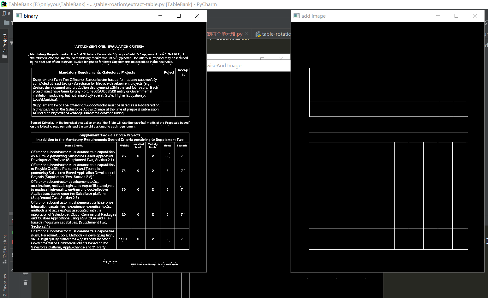
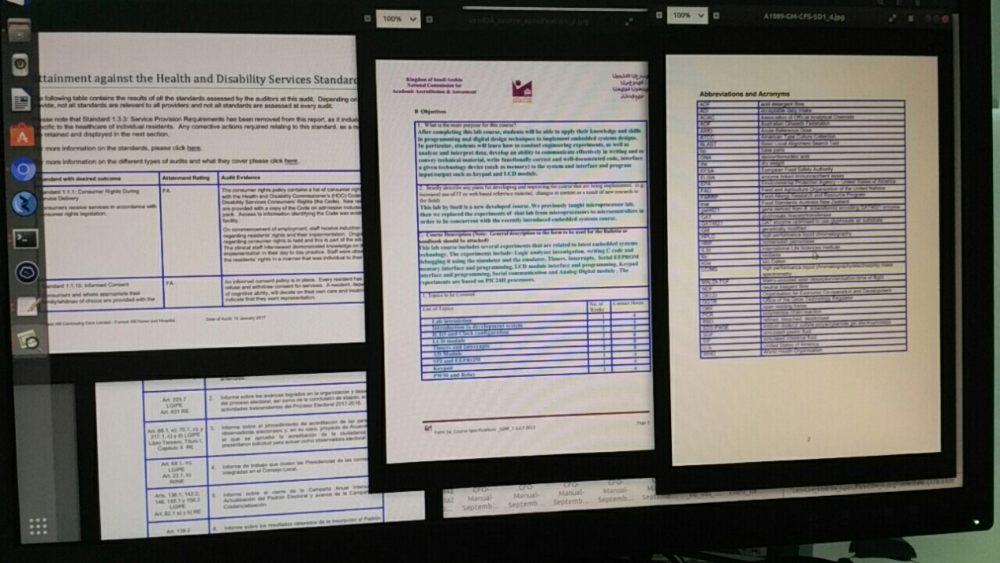
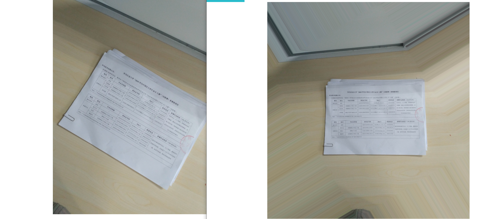
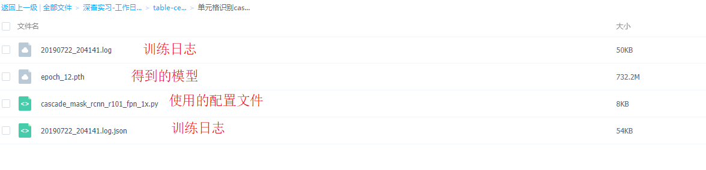
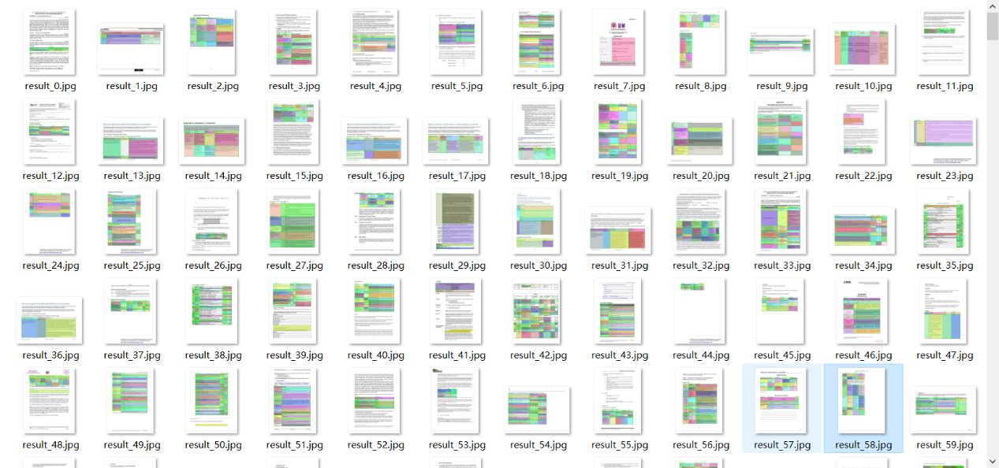
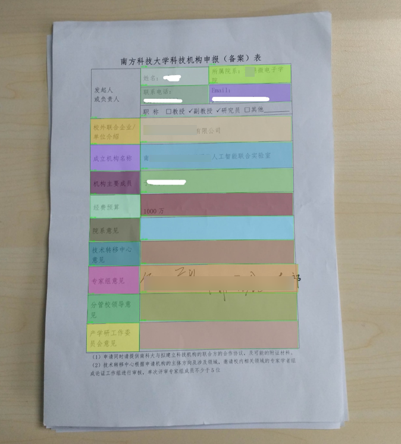
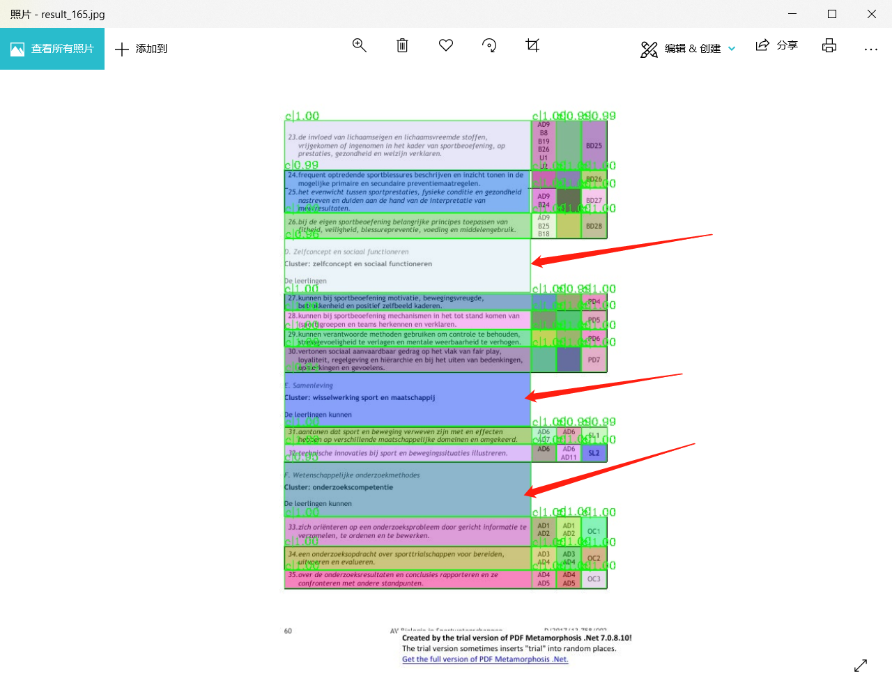

项目说明
========

本项目是我2019年7月份的实习工作的\*\***展示与记录**\*\*：

1.  把倾斜的表格旋转水平；

2.  制作5000张表格数据集，需要标注每一个单元格，并实现单元格检测

第一项比较简单，仿射变换、透视变换已经很成熟了，关键是第二项。

考虑到人工标注太费时（1张表格图片大概30个单元格，大概3～5分钟一张，一共需2500小时），所以尝试利用常规的图像处理，提取出表格线，自动标注。

涉及代码：图像旋转（仿射变换）、表格线提取、转coco格式、可视化、随机保存文件、根据图片文件名匹配对应的标签文件等

关键代码说明：
--------------

### 表格旋转

`table-rotation.py`

只需指定输入图像路径，自动计算旋转角度、仿射变换、旋转调整整个图像（不限于表格图像，文字图像也可以）

过程: 1. HoughLines ——\> get the rotation angle 2. warpAffine ——\>
affine(rotation)

### 从表格图片提取每个单元格坐标

`extract-table-visual.py`

输入一张图片，通过腐蚀膨胀等操作去除表格内容，得到表格线，可视化。本代码的参数设置使可视化效果很好，但实际上左边框可能未闭合（肉眼不可见）

`extract-table.py`

输入一张图片，可视化表格线。为了使表格闭合、得到交点，故意调整参数，使得横线、竖线都更长。

### 制作coco格式数据集

`table-cell-to-coco.py （刚刚修改了多线程处理的bug-12月11日）`

table-cell 单元格识别说明文档
=============================

任务一：tabel-bank数据集（标注到表格级，coco格式）
--------------------------------------------------

### 数据集下载

<https://github.com/doc-analysis/TableBank> （因版权限制，请自行申请链接）

该数据集分两块，word文档版和LaTeX文档版，其中word版比较杂，文件命名不规范，文件名有大量的拉丁文、俄文，中文系统下可能会有编码错误。表格识别任务建议使用LaTeX版的数据集。

使用mmdetection目标识别库进行训练时，只需修改config/xxx.py的数据集目录、图片大小、label_name、label种类数（2，表示表格和背景两类）。

### 表格检测示例图

检测结果示意图（使用最简单的faster rcnn训练12个epoch，准确率达到99%以上）：

任务二：tabel-cell 数据集（标注到单元格级，coco格式）
-----------------------------------------------------

### 对应代码：

table-cell-to-coco.py

### 图片来源：

table
bank数据集word版图片，选取以a-c开头的5116张图片（然后从这5116张图片中随机选择1000张做测试集、其余做训练集）。

### 标签制作：

\`\`\` bash

利用opencv库，提取出表格、单元格，然后转成coco格式

\#\#\#\# 分割单元格步骤

\# 1. 读取图像；

\# 2. 二值化处理；

\# 3. 横向、纵向的膨胀、腐蚀操作，得到横线图img_row和竖线图img_col；

\# 4. 得到点图，img_row + img_col=img_dot；

\# 5. 得到线图，img_row × img_col=img_line（线图只是拿来看看的，后续没有用到）；

\# 6. 根据点图得到闭合矩形单元格（左上角、右下角坐标）

\# 7. 人工设计规则，优化这些坐标

\# 8. 利用得到的坐标、可视化、保存可视化结果，人工从中选出结果好的样例，做数据集

\# 9. 转化为coco格式

\`\`\`

### 示例图

步骤5示例图：

步骤8示例图：

任务三：倾斜矫正、单元格识别
----------------------------

### 倾斜矫正

\`\`\` bash

\# 输入一张倾斜的图像,自动仿射变换、旋转调整整个图像

\# 步骤：

\# 1. HoughLines ——\> get the rotation angle

\# 2. warpAffine ——\> affine(rotation)

\`\`\`

**对应代码：**

table-rotation.py

#### 示例图：

示例图2（拍照，也能精准地调整到水平状态，且不影响表格内容）：

### 单元格识别

利用mmdetection目标识别库，训练任务二标注的table-cell数据集。

需要修改config文件，如config/cascade_mask_rcnn_r101_fpn_1x.py的字段：

数据集路径data_root = '/home/weidafeng/dataset/coco/TableBank/Word/'

类别数目num_classes=2,\#两处

图像大小img_scale=(596，842)

修改label name：

-   mmdetection/mmdet/core/evaluation/class_names.py

-   mmdetection/mmdet/datasets/coco.py

-   python setup.py install

我使用config/cascade_mask_rcnn_r101_fpn_1x.py进行测试，修改后的config文件、训练12个eopch达到99%以上的准确率，该配置文件及模型以上传到云盘（链接:
https://pan.baidu.com/s/1nfGd7s0AMujJ00pCFAOyrA 提取码:
hupu），下载后可进行测试。

测试步骤（详见mmdetection使用说明）：

1.  使用提供的inference.py文件替换mmdetection/mmdet/apis/inference.py（我主要添加以文本形式保存预测结果的函数，不替换也能看到可视化效果）

2.  重新编译 python setup.py install

3.  运行测试代码：

\`\`\` bash

-   bash test.sh \~/test_images/ ../mmdetection/config/mask_xxxx.py
    ../mmdetection/workdir/latest.pth

\`\`\`

#### 测试结果示例图：

测试结果示例图（**拍照，结果一样很好**）：

测试示例图（少部分结果出现漏检、误检）：

Reference：
-----------

### TableBank：

<https://github.com/doc-analysis/TableBank>

### 制作coco格式数据集：

<https://github.com/weidafeng/CCPD2COCO>

### mmdetection

<https://github.com/open-mmlab/mmdetection>

### 图像旋转数学原理：

https://blog.csdn.net/liyuan02/article/details/6750828

### 仿射变换与透射变换：

仿射变换和透视变换更直观的叫法可以叫做“平面变换”和“空间变换”或者“二维坐标变换”和“三维坐标变换”.
从另一个角度也能说明三维变换和二维变换的意思，仿射变换的方程组有6个未知数，所以要求解就需要找到3组映射点，三个点刚好确定一个平面.
透视变换的方程组有8个未知数，所以要求解就需要找到4组映射点，四个点就刚好确定了一个三维空间.

### 傅里叶相关知识：

https://blog.csdn.net/on2way/article/details/46981825  
- 频率：对于图像来说就是指图像颜色值的梯度，即灰度级的变化速度  
- 幅度：可以简单的理解为是频率的权，即该频率所占的比例  
DFT之前的原图像在x y方向上表示空间坐标，DFT是经过x
y方向上的傅里叶变换来统计像素在这两个方向上不同频率的分布情况，
所以DFT得到的图像在x y方向上不再表示空间上的长度，而是频率。
